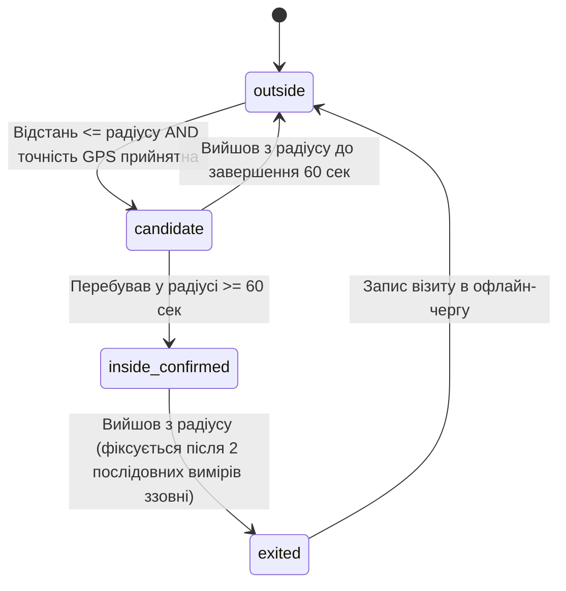

# 🌱 Courier Visit Tracker MVP

Система обліку та відстеження робочих змін та візитів кур'єрів на торгові точки (Locations) у реальному часі. Система спроектована як легке, економічне та стійке до збоїв мережі рішення (offline-first) з використанням Google Sheets як бази даних та Google Apps Script як API-сервера.

---

## 🏗️ Архітектура системи

Система складається з чотирьох основних компонентів:

```mermaid
graph TD
    subgraph Мобільні клієнти
        A[Android App: React Native + Expo] -->|POST/GET JSON| C[Google Apps Script API]
        B[iOS Web Fallback: HTML/JS] -->|POST/GET JSON| C
    end
    
    subgraph Бекенд та База Даних
        C -->|LockService / Запис| D[(Google Sheets)]
    end
end
```

1. **Android App (Основний клієнт):** Написаний на React Native (Expo) + TypeScript. Використовує фонове відстеження геолокації та локальний аналізатор відстані для детекції візитів.
2. **iOS Web Fallback (Адаптивна веб-сторінка):** Роздається сервером Google Apps Script для користувачів iPhone. Працює в ручному режимі (manual check-in) через обмеження фонового GPS в iOS-браузерах.
3. **Google Apps Script Web App (API-сервер):** Обробляє авторизацію, логіку змін, групову синхронізацію та запис у таблицю.
4. **Google Sheets (База даних):** Використовується для адміністрування та збереження результатів.

---

## 📊 Модель даних (Google Sheets)

База даних містить 6 основних листів:

### 1. `Couriers` (Кур'єри)
* `courier_id` (Код кур'єра, наприклад: `C001`)
* `name` (ПІБ)
* `phone` (Телефон)
* `pin_hash` (SHA-256 хеш PIN-коду для входу)
* `token` (Унікальний сесійний UUID)
* `active` (Статус активності: `true`/`false`)
* `platform` (Платформа пристрою: `android`/`ios`)
* `notes` (Коментарі)

### 2. `Locations` (Точки візитів)
* `location_id` (Унікальний код точки: `L001`)
* `name` (Назва магазину/клієнта)
* `address` (Адреса)
* `latitude` / `longitude` (Координати GPS)
* `radius_m` (Радіус зони прибуття в метрах)
* `indoor` (Чи точка всередині будівлі: `true`/`false`)
* `active` (Чи враховувати точку: `true`/`false`)
* `updated_at` (Час оновлення)
* `notes` (Примітки)

### 3. `Shifts` (Робочі зміни)
* `shift_id` (UUID робочої зміни)
* `courier_id` (ID кур'єра)
* `start_time` (Час початку)
* `end_time` (Час завершення)
* `duration_minutes` (Тривалість зміни в хвилинах)
* `device_platform` / `app_version` / `device_id` (Діагностичні метадані)
* `status` (Статус зміни: `active`/`ended`/`auto-closed`)
* `notes` (Коментарі)

### 4. `Visits` (Підтверджені візити)
* `visit_id` (UUID запису візиту)
* `event_uuid` (UUID події з телефону для уникнення дублікатів)
* `courier_id` / `shift_id` / `location_id` (Зв'язки з іншими сутностями)
* `enter_time` / `exit_time` (Час входу та виходу з радіуса)
* `duration_seconds` (Час перебування в секундах)
* `enter_lat` / `enter_lng` / `exit_lat` / `exit_lng` (Координати при вході та виході)
* `accuracy_m` (Точність GPS сигналу)
* `matched_distance_m` (Розрахована відстань до центру точки)
* `source` (Спосіб реєстрації: `auto` / `manual` / `manual_no_gps`)
* `offline_synced` (Чи подія була синхронізована після офлайну: `true`/`false`)
* `created_at` (Час запису на сервері)
* `raw_payload` (JSON сирих даних для аудиту)

### 5. `EventLog` (Системні логи)
Зберігає діагностику роботи програми (дозвіл на GPS, старт фонової служби тощо).
* `log_id`, `event_uuid`, `courier_id`, `shift_id`, `event_type`, `timestamp`, `payload_json`, `created_at`

### 6. `Settings` (Конфігурація системи)
* `default_radius_m` (Радіус за замовчуванням: `30` м)
* `dwell_seconds` (Мінімальний час перебування для зарахування візиту: `60` с)
* `location_interval_ms` (Частота оновлення координат: `15000` мс)
* `distance_filter_m` (Поріг зміни локації для обробки: `10` м)
* `accuracy_ignore_m` (Ігнорувати GPS точки з точністю гірше: `150` м)
* `manual_checkin_enabled` (Увімкнути ручний чекін: `true`)
* `points_version` (Версія списку точок для автооновлення на телефонах)
* `max_stay_minutes` (Максимальний час перебування на одній точці: `240` хв)

---

## 🎯 Алгоритм детекції візитів (Visit State Machine)

Мобільний додаток Android локально аналізує відстань до всіх 500+ точок кожні 15 секунд, не перевантажуючи батарею та трафік.
Розрахунок відстані між координатами здійснюється за **формулою гаверсину** (Haversine formula).

Для кожної точки в пам'яті телефону ведеться свій кінцевий автомат:



* **Candidate (Кандидат):** Фіксується `first_enter_time`. Якщо кур'єр швидко проїхав повз точку (менше 60 секунд) — стан скидається без запису візиту.
* **Jitter Buffer (Захист від перешкод GPS):** При виході з зони стан не змінюється миттєво. Потрібно отримати мінімум 2 послідовні координати ззовні радіуса, щоб уникнути помилкових виходів через коливання сигналу GPS в приміщеннях.
* **Закриття зміни:** Якщо зміна завершується, коли кур'єр перебуває в стані `inside_confirmed`, візит примусово фіналізується із часом виходу = час закриття зміни.

---

## 📡 Специфікація API (Apps Script Routing)

Оскільки Google Apps Script має специфічні обмеження CORS, клієнт відправляє `POST` запити як `Content-Type: text/plain;charset=utf-8` з JSON рядком у тілі.

### 1. `POST /login`
* **Вхідні дані:** `{ courier_id: "C001", pin: "1234" }`
* **Логіка:** Сервер обчислює SHA-256 хеш PIN-коду та порівнює його з `pin_hash` у таблиці `Couriers`. При успіху генерує UUID токен, записує його та віддає налаштування `Settings`.

### 2. `GET /points`
* **Вхідні дані (Query):** `?action=points&token=uuid-token&version=12`
* **Логіка:** Якщо версія точок клієнта збігається з версією сервера — повертає `status: "not_modified"`. Якщо версія змінилася — віддає оновлений масив точок для кешування.

### 3. `POST /shift/start` та `POST /shift/end`
* **Логіка:** Створює або завершує зміну в таблиці `Shifts`. При створенні нової зміни автоматично закриває попередню відкриту зміну кур'єра (захист від збоїв).

### 4. `POST /events/batch` (Синхронізація)
* **Вхідні дані:** `{ token, courier_id, shift_id, batch: [...] }`
* **Логіка:** Приймає масив офлайн-подій. Використовує `event_uuid` для дедуплікації (якщо UUID події вже є в таблиці — вона пропускається, що гарантує відсутність дублів). Записує візити у `Visits`, логи — в `EventLog`.
* **LockService:** Всі операції мутації захищені системним блокуванням `LockService.getScriptLock().waitLock(10000)` для запобігання конфліктів одночасного запису від 60 кур'єрів.

---

## ⚡ Офлайн та синхронізація (Offline-First)

* Додаток повністю зберігає всі події (візити, ручні чекіни, логи, зміни) в локальній базі `AsyncStorage`.
* При відновленні мережі запускається процес синхронізації.
* Якщо запит завершується помилкою (наприклад, ліміт Apps Script чи відсутність інтернету), додаток планує повторний запуск синхронізації з **експоненціальною затримкою (Exponential Backoff)**: спочатку через 5 секунд, потім 10, 20, 40... до максимум 5 хвилин. Це запобігає розряду батареї та DDOS-ефекту на сервер.

---

## 🔄 Інтеграція та синхронізація коду (Clasp)

Для зручності розробки налаштовано інструмент **Google Clasp**, який зв'язує локальну папку `backend/` із хмарним проектом Google Apps Script.

### Конфігураційні файли:
* **`.clasp.json`** — містить `scriptId` та вказує на робочу директорію `rootDir: "./backend"`.
* **`backend/appsscript.json`** — маніфест Apps Script проекту (налаштування Timezone `Europe/Kiev` та доступу до Web App).

### Робочі команди в терміналі:
1. Авторизація (виконується один раз):
   ```bash
   npx @google/clasp login
   ```
2. Синхронізація (відправка локального коду в хмару):
   ```bash
   npx @google/clasp push -f
   ```

---

## 🚀 Настанови щодо майбутнього розширення (Future Upgrades)

Якщо проект переросте MVP, архітектурно закладено такі шляхи масштабування:
1. **Зміна бази даних:** Замість Google Sheets API в `src/services/api.ts` можна підключити Firebase FireStore або Node.js / PostgreSQL бекенд на AWS/GCP. Інтерфейс додатку та логіка VisitDetector при цьому не зміняться.
2. **Перехід на Geofencing OS:** Якщо кількість точок зменшиться, або виникне потреба у нативній детекції OS, можна інтегрувати бібліотеки `expo-location` нативного геофенсингу замість локального розрахунку відстані.
3. **Розширення аналітики:** На базі Looker Studio можна підключити розрахунок KPI кур'єрів (своєчасність прибуття, тривалість перебування на точках).
4. **Фільтрація точок за регіонами (містами):** При масштабуванні на 12+ міст, додати колонку `city` / `region` в таблиці `Couriers` та `Locations`, і фільтрувати точки на стороні API (у `GET /points`), щоб кур'єр бачив і відстежував лише локації свого міста.
